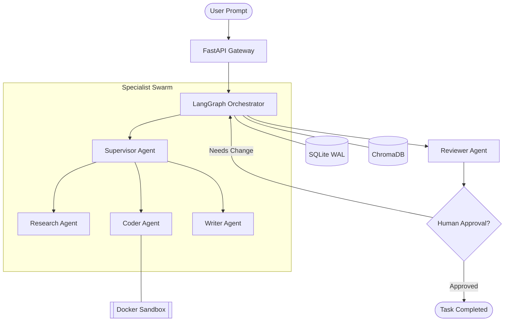

<div align="center">
  
  
  
  
  

  <h1 align="center">Sentinel: Multi-Agent Orchestration System</h1>
  <p align="center">
    <strong>An enterprise-grade AI orchestration platform featuring a Supervisor-Specialist architecture, real-time observability, and production-ready persistence.</strong>
  </p>

  <p align="center">
    <a href="#-key-features">Features</a> •
    <a href="#-engineering-highlights">Engineering Highlights</a> •
    <a href="#-architecture">Architecture</a> •
    <a href="#-getting-started">Getting Started</a> •
    <a href="#-observability">Observability</a> •
    <a href="#-portfolio-deep-dive">Portfolio Deep Dive</a>
  </p>
</div>

---

## 🌟 Overview

**Sentinel** is a high-performance AI engineering showcase built to demonstrate advanced patterns in agentic workflows. Unlike simple linear chains, Sentinel uses a **cyclic state machine (LangGraph)** to decompose complex natural language tasks into dynamic execution plans.

It bridges the gap between AI research and production software engineering by implementing robust error handling, sandboxed code execution, and high-concurrency database patterns.

---

## ✨ Key Features

- **🧠 Dynamic Task Decomposition**: A central Supervisor LLM analyzes tasks and routes them to specialized agents (Research, Coder, Writer).
- **🛡️ Secure Code Sandbox**: Dual-layer Python execution (Docker Container → Local Subprocess fallback) with strict resource limits.
- **🔄 Human-in-the-Loop**: Integrated approval gates for sensitive operations (e.g., executing LLM-generated code).
- **💾 Durable State Management**: Uses **SqliteSaver** to persist agent threads, allowing workflows to survive server restarts.
- **📊 Real-Time Observability**: Live event streaming via **Server-Sent Events (SSE)** and integrated **OpenTelemetry** tracing.

---

## 🛠️ Engineering Highlights (Placement Friendly)

*   **Concurrency Control**: Implemented **SQLite WAL (Write-Ahead Logging)** mode, enabling the frontend to query history via SSE without being blocked by intensive agent write operations.
*   **Resilient Sandboxing**: Engineered a graceful fallback mechanism for code execution. The system detects Docker availability and switches to a restricted `subprocess` environment if the daemon is missing.
*   **State Machine Design**: Leveraged **LangGraph** to build a cyclic graph with state persistence, enabling complex "plan-execute-verify" loops rather than simple one-shot prompts.
*   **Memory Architecture**: Integrated a dual-layer memory system—**Short-term (Thread Checkpoints)** for session continuity and **Long-term (ChromaDB)** for semantic retrieval of past experiences.

---

## 🏗️ Architecture



---

## 🚀 Getting Started

### One-Command Startup (Recommended)
The entire stack can be launched via Docker Compose:

```bash
# 1. Clone & Set Environment
git clone https://github.com/mithilgala-cmd/agent-orchestration-system.git
cd agent-orchestration-system/backend && cp .env.example .env
# Set your GROQ_API_KEY in .env

# 2. Spin up everything
cd ..
docker compose up --build
```

Access the Dashboard at **http://localhost:3000**.

### Manual Setup
Refer to the [Backend README](./backend/README.md) and [Frontend README](./frontend/README.md) for detailed manual installation steps.

---

## 📊 Observability & Tracing

Sentinel tracks every token and every decision. The **Trace Explorer** tab in the dashboard provides:
- **Aggregated Token Usage**: Precise counts for prompt and completion tokens.
- **Cost Estimation**: Real-time calculation based on model-specific pricing ($0.70/1M tokens).
- **Duration Metrics**: Wall-clock time for each node in the execution graph.

---

## 📄 Portfolio Deep Dive

For a detailed technical breakdown of the architecture, tradeoffs, and design decisions made during the development of Sentinel, please see:
👉 **[PORTFOLIO.md](./PORTFOLIO.md)**

---

<div align="center">
  <sub>Built with ❤️ for the AI Engineering Community.</sub>
</div>
